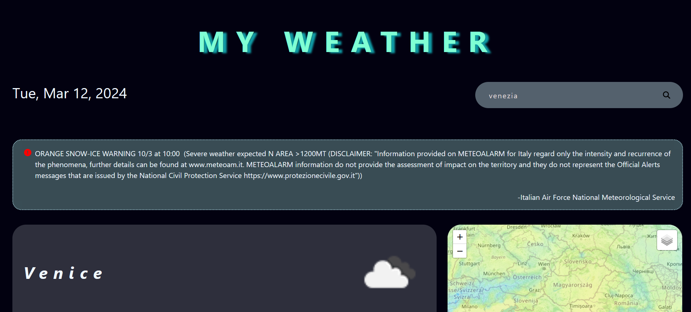
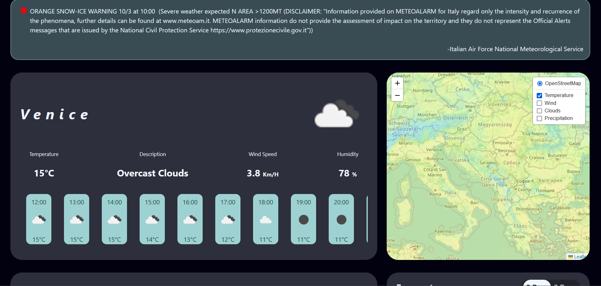
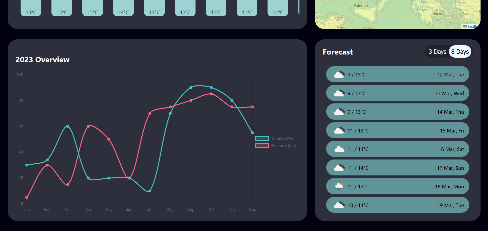

# Weather Project

## Introduction

The "Weather" project is an app developed using HTML,CSS,JS, React and JS libraries such as ChartJS and Leaflet. App where you can explore realtime weather data.

## Features

- Real-Time Weather Data.
- Hourly Weather Forecast
- Extended Forecast(choose between 3-day or an 8-day forecast)
- Last Year Weather Data Overview in Charts.
- Interactive Map with different layers for temperature, clouds etc.

**Screenshots**

## Installation

### Prerequisites

Before you can run Weather app, ensure your system meets the following requirements:

- _API Key_: Register at OpenWeatherMap to obtain your API key (https://openweathermap.org/)
- [Node.js](https://nodejs.org/)
- Git: to clone repository, for version control (https://git-scm.com/)
- Leaflet: JS library for interactive maps. Install it using npm by runnig `npm install leaflet`
- ChartJS: JS library for data visualization. Install it using npm by runnig `npm install chart.js`

### Setup

1.  **Clone the repository.**

    git clone https://github.com/illaan/playground-weather

2.  **Navigate to the Projcet Directory**

Open your terminal or command prompt and execute the following commands to navigate to the frontend directory:
`cd weather`

3. **Install dependencies**

Within weather directory:
`npm install`

4. **Start the Server**
   Within weather directory, start the server with the following command:
   `npm run dev`
